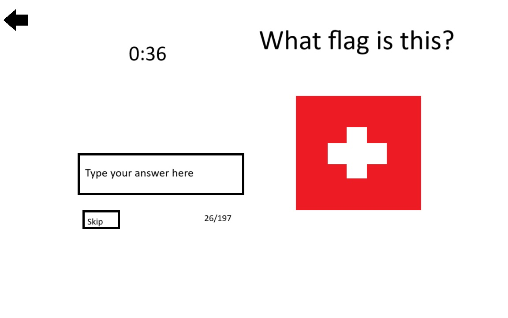

:warning: Everything between << >> needs to be replaced (remove << >> after replacing)

# Flags Quiz
## CS110 Final Project Fall 2024

## Team Members

Zach Renzi

***

## Project Description

A simple quiz game to test knowledge of flags.

***    

## GUI Design

### Initial Design

### Final Design

## Program Design

### Features

1. main menu
2. saved highscores
3. continent quizzes
4. world quizzes
5. flag quizzes

### Classes

- Flag: creates a flag object

## ATP

| Step                 |Procedure             |Expected Results                   |
|----------------------|:--------------------:|----------------------------------:|
|  1                   | Run Counter Program  |GUI window appears with count = 0  |
|  2                   | click count button   | display changes to count = 1      |
etc...
