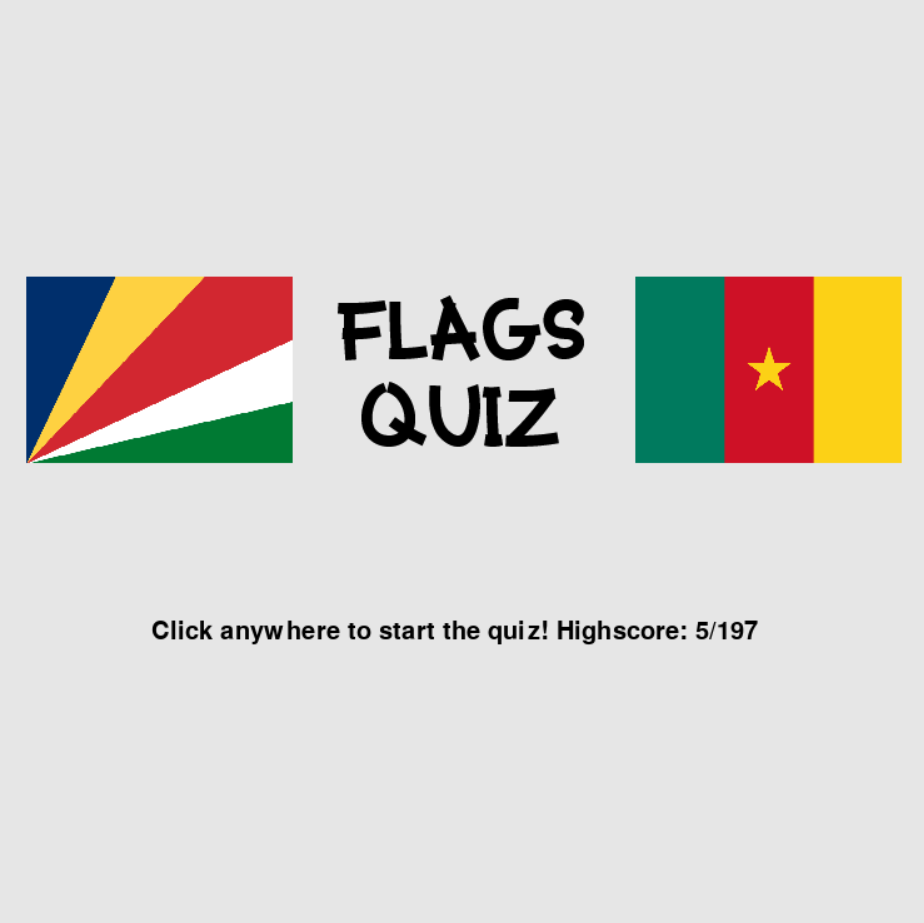
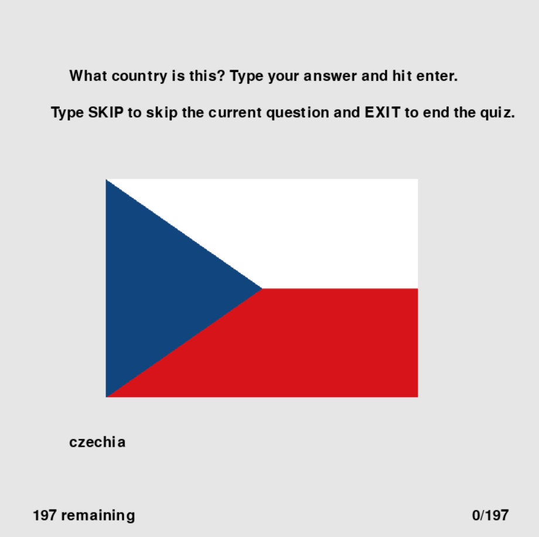

# Flags Quiz
## CS110 Final Project Fall 2024

## Team Members

Zach Renzi

***

## Project Description

A simple quiz game to test knowledge of flags.

***    

## GUI Design

### Initial Design

### Final Design

## Program Design

### Features

1. main menu
2. saved highscore
3. flag quiz

### Classes

- Flag: creates a flag object
- Quiz: manages the quiz
- NameToCC: converts a country name to a country code
- Highscore: saves and gets the players highscore

## ATP

test case 1: quiz loop
    test description: ensure the quiz loop starts
    test steps:
        1. start the game
        2. click anywhere on the screen
    expected outcome: the quiz should begin with a random flag on the screen

test case 2: typing
    test description: ensure the user can type in the text box
    test steps:
        1. start the game
        2. click anywhere on the screen
        3. type any letters
        4. type any symbols
        5. hit backspace
    expected outcome: the letters should show up on screen while the symbols should not. backspace should remove the last character typed

test case 3: skipping
    test description: ensure the user can skip a question
    test steps:
        1. start the game
        2. click anywhere on the screen
        3. type "skip"
        4. hit enter
    expected outcome: a new flag should show up on screen, the word "skip" should be gone from the screen, and the remaining flags counter at the bottom left of the screen should decrease by 1

test case 4: correct flag
    test description: ensure desired behavior when a question is answered correctly
    test steps:
        1. start the game
        2. click anywhere on the screen
        3. type "skip" and hit enter until a flag which is known appears on screen
        4. enter the name of the country
        5. hit enter
    expected outcome: a new flag shows up on screen, the typed country name is gone from the screen, the remaining flags counter decreases by 1, and the counter in the bottom right increases by 1 to indicate the user answered correctly

test case 5: completed quiz
    test description: ensure the quiz is reset when the quiz ends
    test steps:
        1. start the game
        2. take note of the highscore value displayed
        3. click anywhere on the screen
        4. answer or skip questions until the remaining flag counter reaches 0
    expected outcome: once the counter reaches 0, the initial menu is once again shown on screen. if the score achieved in the quiz was higher than the value shown on initial startup, it is shown as a new highscore. if the score achieved was lower than the previous high score, the value remains unchanged